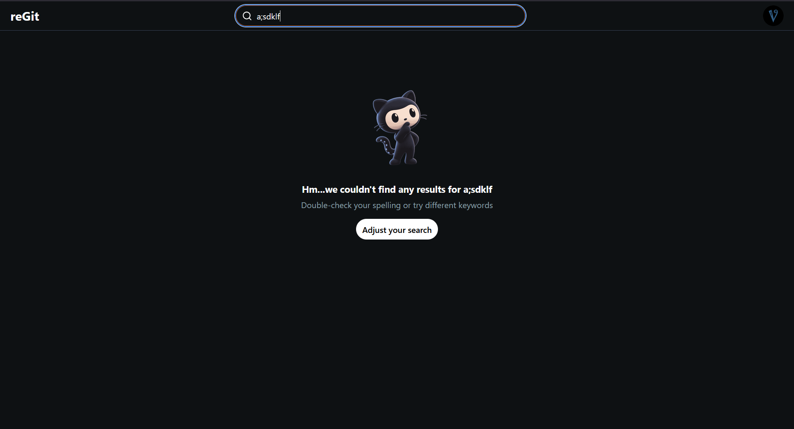

# reGit

## A GitHub user lookup app made using the GitHub REST API, React and TypeScript

A GitHub user lookup app with a Reddit-inspired UI, built with React, TypeScript and Tailwind CSS v4. This app contains:

1. Search for any GitHub user by their exact username
2. Profile card showing avatar, name, bio, stats and join date
3. Repository list with language color dots and star, watcher and fork counts
4. Starred repositories displayed in the sidebar

## Try it here!
[Click me!](https://victosn.github.io/reGit/)

## How it works
- All API calls are made directly to the GitHub REST API from the browser, no API key required
- The API layer in src/api/github.ts is the only file that talks to the network
- A custom hook fetches the user, their repos and their starred repos, then reports the result through a status value
- Language dots use GitHub's official colors, with gray as the fallback for unknown languages

## Screenshots
### Default Interface


### User Example


### User Has No Repo


### User Not Found



## How to run
1. Clone the repo
2. Run:

```bash
npm install
```

3. Run:

```bash
npm run dev
```

## License
This project is licensed under the [MIT License](LICENSE)
